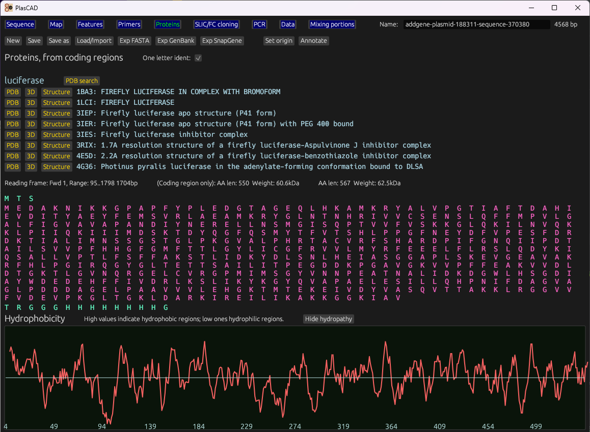

# PlasCAD

Design software for plasmid (vector) and primer creation and validation. Edit plasmids, perform PCR-based cloning, digest and ligate DNA fragments, and display details about expressed proteins. Integrates with online resources like NCBI and PDB.

## Installation

### Windows and Linux
[Download, unzip, and run](https://github.com/David-OConnor/plascad/releases). 

Notes: 
- On some Linux distros (eg Ubuntu), run `setup_linux_desktop.sh`, included in the zip, to create a Desktop GUI entry.
- On Windows, the first time you run the program, you may get the message *"Microsoft Defender prevented an unrecognized app from starting"*. To bypass this, click *More info*, then *Run Anyway*.

### Mac
Compile from source by [downloading and installing Rust](https://www.rust-lang.org/tools/install), then running `cargo install plascad` from a CLI.

## Current functionality

### Primer QC and tuning
Evaluates primers for quality in several metrics: melting temperature, GC content, 3' end stability, repeats, and possibility
of forming self-end dimers.

This allows primer length to be automatically or manually changed to optimize these parameters. This is done by marking
one or more primer end as not having a fixed starting point, and providing more-than-expected nucleotides of the matching 
sequence on this end. The end point can then be adjusted to optimize primer qualities.

When both ends are marked as tunable, PlasCAD assumes this primer is for attaching two DNA fragments together, as in SLIC and FC cloning.

#### Note on TM calculations
Melting temperature (TM) can be a difficult to accurately estimate, and depends on parameters specific to the master mix used during PCR. This program uses nearest-neighbor ΔH and ΔS calculations, augmented with salt compensation. Its results are generally close to those provided by [IDT](https://www.idtdna.com) and [Biopython](https://biopython.org/) with default parameters. Its results are generally lower than those used by SnapGene and AmplifX, largely due to the way salt compensation is handled. See the *Calculations used* section at the bottom of this readme for more information.

### Primer generation for SLIC and FastCloning
Given the sequences for an insert, a vector, and insertion point, it will generate primers suitable for SLIC and FastCloning.
It generates primers to amplify the entire vector, and insert primers that contain suitable overlap regions with the vector.

It will also create a new file containing the sequence of the cloning product.

### Sequence viewer and editor

This shows the sequence of interest (as generated from cloning, or manually input) with primers overlayed based on their
match location. It also displays cut sites for common restriction enzymes, and features loaded from a file, or set by the user.
It includes basic reading frame (ORF) viewing for coding regions.

It lets you do standard edit operations in a what-you-see-is-what-you-get manner. Ie, you can click the sequence to set the cursor,
move the cursor with arrow keys, type the letters *A*, *C*, *T*, and *G* to insert nucleotides, etc.

#### Notes:
- Double-click to select a feature.
- Ctrl+F to search for a sequence.
- Middle-click on a tab to close it.

- Ctrl+C and Ctrl+V to copy and paste sequences. (Can copy selected nucleotides, features, and primers)
- Ctrl + A to select all nucleotides.
- Click and drag to select text.
- Use the keyboard to insert nucleotides, move the cursor etc.
- When a feature or primer is selected, that's what's copied, vice the selection.
- Feature and primer editor tables are availabe to be displayed above the sequence.
- You can use the sliders and inputs at the top to change the selected feature range.
- You can quickly create a feature or primer from the cursor selection using the buttons at the top.
- Press the *Escape* key to remove selections and the cursor.

### Circular map
A circular sequence map of the plasmid being edited, with features, primers, restriction enzyme sites, and other data displayed.

#### Notes:
- Click to select a feature
- You can change feature ranges using the sliders, or their adjacent text boxes at the top.
- The feature editor table is available to be displayed above the map

### Feature and primer annotations
Can create, edit, and load features and primers. We define a *feature* as matching explicitly to specific indexes in the sequence. They are general-purpose, are associated with metadata, and work in a similar way to features in other software.

*Primer*s are not defined by index, but as sequences of nucleotides that are dynamically matched to the opened sequence.

### Restriction enzyme and tag dynamic annotation
Automatically identies and marks common restriction enzyme sites, and tags, such as the 6x or 8x HIS tag.

### PCR product generation and parameter generation
Generates a PCR product using the opened sequence, and any primer pair.

Generates PCR parameters (eg temperature and time for specific steps), based on product length, primer
melting temperature, polymerase type, and other parameters.

### Interop with FASTA, GenBank, and SnapGene
PlasCAD can read and write FASTA, GenBank, and SnapGene .dna files. FASTA files store sequence data only, while GenBank, SnapGene, and PlasCAD's own format store sequence data, features, primers, and metadata. We use the [gb_io](https://docs.rs/gb-io/latest/gb_io/) library
to handle GenBank parsing and writing.

### Notes
- To open files, you can either use the *Load/Import* button at the top, or drag a file into the window.
- When clicking *Save* (Ctrl+S), the file saved to is named in the tilebar (Very top of the window). This program will save over PCAD and GB files, but not SnapGene/DNA or FASTA files. (See details below re why). To save in those formats, use the appropriate *Export* button.
- If no file is open, *Save* will be replaced with *Quicksave*; this saves to a temporary file, in the same location as the program.
- When importing FASTA files, common features are automatically annotated from the sequence.

### When to use each file format
If you don't have interoperability requirements, you can use PlasCAD's own file format (.pcad extension) using the *Save* and *Load* buttons. This is a binary format that results in smaller file sizes (Generally 4-10x smaller) than the others, due to using 2-bits to store each nucelotide, and a compact overal format. [WIP documention](file_spec.md).

[GenBank](https://www.ncbi.nlm.nih.gov/genbank/) and SnapGene are popular formats, and provide interoperability with other software. [AddGene](https://www.addgene.org/) and other resources have files available in these formats.

PlasCAD currently cannot process all data in the DNA format, nor can it produce a DNA file capable of being opened by SnapGene. This means you can open DNA files and get most of the useful data (sequence, features, primers), but we do not recommend saving in this format. With this in mind, **GenBank is the best format for compatibility with other software**.

FASTA files contain only sequence data, so exporting to this format will result in the loss of feature and primer data, and metadata.

Note that GenBank does not retain primer sequences directly; it stores them as features with fixed binding sites. We are able to convert bewteen the two
when saving and loading, but this is not ideal. The PlasCAD and SnapGene formats store primers as sequences, with binding
sites determined dynamically.

#### Associating files with PlasCAD
If you wish to associate a file type (eg the native .pcad format) with PlasCAD, you must set it up manually with your operating system, as PlasCAD does not have an installer. Example on Windows: *Right-click a file → Open With → Choose another app → 
(Select where you saved the program) → Always.*

### Automatic annotation
Annotate the common features from sequences; this includes promoters, origins of replication, affinity binding tags,  and antibiotic resistance
genes.

### Amino acid sequences and other protein data

Displays amino acids inline with the sequence, and includes a dedicated page which shows amino acid sequences for all coding regions. This infers the reading frame based on marked coding region features, finding the best match of the 6 frames. It displays the amino acid sequence for each reading frame, with the part marked as a coding region highlighted.

Displays a hydropathy chart of each amino acid, showing how hydrophobic each region of the protein is likely to be.

Optionally loads data from the [RCSB Protein Data Bank](https://www.rcsb.org) (via [PDB's API](https://data.rcsb.org/#data-api)). Finds proteins that match each coding region. From these, it can automatically open a browser to PDB's entry on this protein, its 3D viewer, or download structure data (i.e. atomic coordinates). 

### Mixing portions assistant
Given a designed solution with molarity concentrations, calculates the mass and volumes required to make the solution. Includes the molecular weights of common reagents. Can set up solutions mixed from custom precursor solutions.

## Why another plasmid editor
The more tools available for scientists, the better. In particular, my goal is to make
a fast, lightweight program that's as easy to use as possible, without sacrificing functionality. I also added functionality I didn't see elsewhere, like automatic primer tuning, and primer generation for SLIC and FastCloning.

Also of note, the native file format this program uses is more compact, including for DNA sequences, where each nucleotide only takes up 2 bits, as opposed to 8 in common formats.

Performance is a top priority; compared to other tools, this has a small program size, small memory footprint, and low CPU use.
It starts fast, and responds instantly.

## Near-term plans
- QCing plasmids for toxic proteins, hydrophobic regions, and aggregation-prone regions
- QC primers for problems in context of plasmids. (Eg multiple/partial binding sites)
- Identifying secondary structures, hairpins etc
- Utility features for specific applications
- Better display of overlapping features
- An automatic annotation system for genes

## Calculations used 
The primer melting temperature method used is based on [SantaLucia & Hicks (2004)](https://pubmed.ncbi.nlm.nih.gov/15139820/). It uses each pair of adjacent nucleotides in the
primer sequence to estimate entropy and enthalpy values, used in the following calcluation, where $ΔH$ is enthalphy, $ΔS$ is entropy, and $C_T$ is 
primer Molar concentration:

$$ (1000 * ΔH) / (ΔS + R \times ln(\frac{C_T}{4})) - 273.15 $$

The calculation also includes salt correction, derived from BioPython, using concentrations of $K^+$, $Na^+$, $Mg^{2+}$, and dntp concentration. (SantaLucia, 1998) These ion concentrations are provided by the user, or initiated with defaults.

We score primer length compared to an ideal of 18-24 nucleotides. Note that for cloning primers that join sequences (eg SLIC insert primers), length is scored between each end and the anchor (The point the two sequences are joined at, towards the middle of the primer.) We expect these primers to be about twice the length of normal primers.

We calculate the following categories of nucleotide repeats:
- Single nucleotides repeated 4 or more times in a row
- Nucleotide pairs repeated 4 or more times in a row
- Any sequence of 3 or more nucleotides that occurs more than once in a sequence

*Primer quality* is a fuzzy metric, and is calculated as a weighted average from other metrics. It's the quantity our tuning algorithm optimizes when adjusting primer length.

Protein weight is calculated by summing the individual atomic weights of constituent amino acids, then subtracting 18.05 g/mol
per link. (number of amino acids - 1). 

Primer weight is computed by summing individual nucleotide atomic weights, then subtracting 61.96 g/mole to account for the repoval of HPO₂, and the addition of two hydrogen molecules.

Protein hydrophathy is calculated using the [Kyte & Doolittle](https://web.expasy.org/protscale/)  [Paper](https://sci-hub.scrongyao.com/10.1016/0022-2836(82)90515-0) method; 
each amino acid is given a hydropathy index. The result at each amino acid position is from an average of these indexes in a window centered on the position, using uniform weights. It uses a window-size of 9 amino acids.